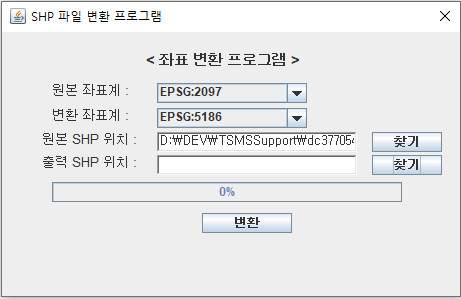
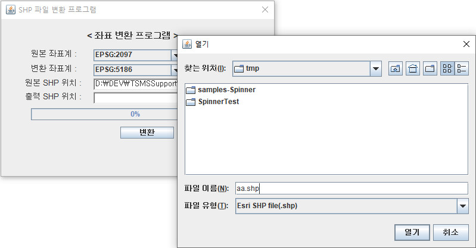
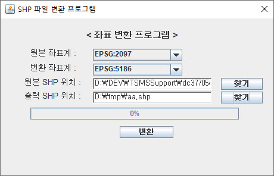
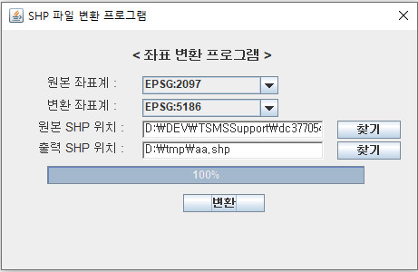

# Coordinate transformation system using SHP file

With Esri's SHP file, this program can be one option to transform one coordination system to another one.
You can compile with any version of java version even 1.2 to latest one.
You can also use a application with the archive file(7z). 

Here are some screen shots for the application.

